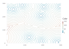

# FastMarching

This is a (partial) port of  [Accurate Fast Marching](https://se.mathworks.com/matlabcentral/fileexchange/24531-accurate-fast-marching?ue) by Dirk-Jan Kroon

## Example

Multiple starting points:
```julia
using FastMarching, Gadfly
tsize = 300
npoints = 10
SpeedImage = ones(tsize,tsize)
SourcePoint = rand(2,npoints).*tsize.+1

t1 = FastMarching.msfm(SpeedImage, SourcePoint, true, true)

draw(SVG("examples/multistart.svg"),
    Gadfly.plot(z=t1, Geom.contour))

```



Originally ported to Julia 0.2, updated for 1.0 2018.

[](https://github.com/invenia/BlueStyle)
